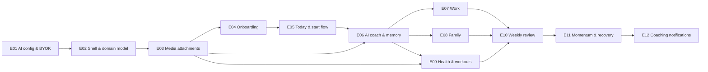

# EvolvePath Roadmap

> **Become who you want to be — one action at a time.**

This is the single tracking document for all product work. It sits beside [VISION.md](VISION.md) and [PRD.md](PRD.md); the executable detail for every epic and child issue lives in [docs/epics/](docs/epics/README.md) and on GitHub.

## The product loop we are building

Aspiration → Outcome → Plan → Routine → Commitment → Action → Evidence → Reflection → Adaptation → Consistency → Change. The product owns the plan (deterministic state); the AI owns the coaching (probabilistic intelligence). Every epic below adds a testable slice of that loop.

**Delivery principle:** each epic is testable end to end — database + API + UI — from a clean clone, using the fake OpenAI server so no epic's verification spends money. Each epic's last child adds the Playwright e2e spec that proves it.

## Epics

| # | Epic | GitHub | Status | Done / total | Phase |
|---|------|--------|--------|--------------|-------|
| E01 | [AI Provider Configuration & Bring-Your-Own-Key](docs/epics/E01-ai-configuration-byok.md) | [#20](https://github.com/marinoscar/evolvepath/issues/20) | Not started | 0 / 12 | Phase 1 — Foundation |
| E02 | [Product Shell, Domain Model & Path Screen](docs/epics/E02-product-shell-domain-model.md) | [#33](https://github.com/marinoscar/evolvepath/issues/33) | Not started | 0 / 8 | Phase 1 — Foundation |
| E03 | [Media Attachments for AI Advice](docs/epics/E03-media-attachments.md) | [#67](https://github.com/marinoscar/evolvepath/issues/67) | Not started | 0 / 8 | Phase 1 — Foundation |
| E04 | [Onboarding: Best Self → First Path](docs/epics/E04-onboarding-first-path.md) | [#99](https://github.com/marinoscar/evolvepath/issues/99) | Not started | 0 / 6 | Phase 2 — Core loop |
| E05 | [Today Screen, Commitments Lifecycle & Start Flow](docs/epics/E05-today-commitments-start-flow.md) | [#34](https://github.com/marinoscar/evolvepath/issues/34) | Not started | 0 / 7 | Phase 2 — Core loop |
| E06 | [AI Coach: Context Assembler, Coaching Reasoner, Mutation Protocol & Memory](docs/epics/E06-ai-coach-memory.md) | [#57](https://github.com/marinoscar/evolvepath/issues/57) | Not started | 0 / 9 | Phase 2 — Core loop |
| E07 | [Work Domain: Focus Sessions & Anti-Procrastination](docs/epics/E07-work-focus-anti-procrastination.md) | [#97](https://github.com/marinoscar/evolvepath/issues/97) | Not started | 0 / 6 | Phase 3 — Domains |
| E08 | [Family Domain: Commitments & Rituals](docs/epics/E08-family-commitments-rituals.md) | [#35](https://github.com/marinoscar/evolvepath/issues/35) | Not started | 0 / 5 | Phase 3 — Domains |
| E09 | [Health Domain: Workout Programs, Runner & Media Coaching](docs/epics/E09-health-workouts-media-coaching.md) | [#66](https://github.com/marinoscar/evolvepath/issues/66) | Not started | 0 / 11 | Phase 3 — Domains |
| E10 | [Weekly Review & Weekly Planning](docs/epics/E10-weekly-review-planning.md) | [#60](https://github.com/marinoscar/evolvepath/issues/60) | Not started | 0 / 5 | Phase 4 — Adaptation |
| E11 | [Momentum, Progress & Recovery](docs/epics/E11-momentum-progress-recovery.md) | [#94](https://github.com/marinoscar/evolvepath/issues/94) | Not started | 0 / 6 | Phase 4 — Adaptation |
| E12 | [Coaching Notifications](docs/epics/E12-coaching-notifications.md) | [#44](https://github.com/marinoscar/evolvepath/issues/44) | Not started | 0 / 7 | Phase 4 — Adaptation |

Status values: Not started · In progress · Done. "Done / total" mirrors the GitHub sub-issue progress bar on the epic; update it when children close.

## Dependency graph

Phases: **1 Foundation** (E01–E03) · **2 Core loop** (E04–E06) · **3 Domains** (E07–E09, parallelizable) · **4 Adaptation** (E10–E12).

## Per-epic checklists

### E01 — AI Provider Configuration & Bring-Your-Own-Key

Epic: [#20](https://github.com/marinoscar/evolvepath/issues/20) · Spec: [docs/epics/E01-ai-configuration-byok.md](docs/epics/E01-ai-configuration-byok.md) · Verify: see "Manual end-to-end verification" in the spec.

- [ ] [#21](https://github.com/marinoscar/evolvepath/issues/21) feat(db): add ai_invocations table for AI observability
- [ ] [#22](https://github.com/marinoscar/evolvepath/issues/22) feat(api): add AI persona registry, settings schema and model version filter
- [ ] [#23](https://github.com/marinoscar/evolvepath/issues/23) feat(api): add OpenAI provider over the Responses API with structured and image input
- [ ] [#24](https://github.com/marinoscar/evolvepath/issues/24) feat(api): add admin AI settings endpoints with live model catalog and test connection
- [ ] [#25](https://github.com/marinoscar/evolvepath/issues/25) feat(api): add per-user OpenAI key endpoints and aiKey status on /auth/me
- [ ] [#26](https://github.com/marinoscar/evolvepath/issues/26) feat(api): add AI gateway with invocation logging and attachment resolution
- [ ] [#27](https://github.com/marinoscar/evolvepath/issues/27) feat(web): add AI settings admin page with persona model selectors
- [ ] [#28](https://github.com/marinoscar/evolvepath/issues/28) feat(web): add user OpenAI key settings page and shared key form
- [ ] [#29](https://github.com/marinoscar/evolvepath/issues/29) feat(web): gate signed-in users without an OpenAI key behind the setup flow
- [ ] [#30](https://github.com/marinoscar/evolvepath/issues/30) test(tests): add fake OpenAI server and end-to-end AI key and admin flows
- [ ] [#31](https://github.com/marinoscar/evolvepath/issues/31) docs(docs): create the missing docs/specs/settings-ui.md
- [ ] [#32](https://github.com/marinoscar/evolvepath/issues/32) docs(docs): document AI configuration, BYOK and the "Adding an AI persona" recipe

### E02 — Product Shell, Domain Model & Path Screen

Epic: [#33](https://github.com/marinoscar/evolvepath/issues/33) · Spec: [docs/epics/E02-product-shell-domain-model.md](docs/epics/E02-product-shell-domain-model.md) · Verify: see "Manual end-to-end verification" in the spec.

- [ ] [#36](https://github.com/marinoscar/evolvepath/issues/36) feat(db): add EvolvePath core domain schema
- [ ] [#39](https://github.com/marinoscar/evolvepath/issues/39) feat(api): add Best Self, Outcomes and Domain Mode endpoints
- [ ] [#42](https://github.com/marinoscar/evolvepath/issues/42) feat(api): add Plans with versioning and Routines endpoints
- [ ] [#47](https://github.com/marinoscar/evolvepath/issues/47) feat(api): add Commitments, Evidence and Reflections endpoints
- [ ] [#51](https://github.com/marinoscar/evolvepath/issues/51) feat(web): add app shell with Today/Path/Coach/Progress/Profile navigation
- [ ] [#56](https://github.com/marinoscar/evolvepath/issues/56) feat(web): add Path screen with outcome, plan version and routine management
- [ ] [#58](https://github.com/marinoscar/evolvepath/issues/58) feat(web): add PWA baseline with manifest, icons and app-shell service worker
- [ ] [#62](https://github.com/marinoscar/evolvepath/issues/62) test(tests): E02 end-to-end verification

### E03 — Media Attachments for AI Advice

Epic: [#67](https://github.com/marinoscar/evolvepath/issues/67) · Spec: [docs/epics/E03-media-attachments.md](docs/epics/E03-media-attachments.md) · Verify: see "Manual end-to-end verification" in the spec.

- [ ] [#71](https://github.com/marinoscar/evolvepath/issues/71) fix(api): enforce storage MIME allowlist and size limits
- [ ] [#74](https://github.com/marinoscar/evolvepath/issues/74) feat(db): add media attachments model
- [ ] [#79](https://github.com/marinoscar/evolvepath/issues/79) feat(api): add video frame sampling processor
- [ ] [#83](https://github.com/marinoscar/evolvepath/issues/83) feat(api): add media attachment endpoints
- [ ] [#87](https://github.com/marinoscar/evolvepath/issues/87) feat(api): media pipeline hardening
- [ ] [#91](https://github.com/marinoscar/evolvepath/issues/91) feat(web): add MediaAttachmentPicker component
- [ ] [#96](https://github.com/marinoscar/evolvepath/issues/96) feat(web): add "Ask the coach about this" media flow
- [ ] [#103](https://github.com/marinoscar/evolvepath/issues/103) test(tests): E03 end-to-end verification

### E04 — Onboarding: Best Self → First Path

Epic: [#99](https://github.com/marinoscar/evolvepath/issues/99) · Spec: [docs/epics/E04-onboarding-first-path.md](docs/epics/E04-onboarding-first-path.md) · Verify: see "Manual end-to-end verification" in the spec.

- [ ] [#100](https://github.com/marinoscar/evolvepath/issues/100) feat(db): add user_profiles with onboarding state and expose onboarding status on /auth/me
- [ ] [#101](https://github.com/marinoscar/evolvepath/issues/101) feat(api): add onboarding endpoints with AI plan proposal, confidence check, approve and skip-ai templates
- [ ] [#102](https://github.com/marinoscar/evolvepath/issues/102) feat(web): add the onboarding wizard at /onboarding with per-step persistence
- [ ] [#104](https://github.com/marinoscar/evolvepath/issues/104) feat(web): add the first-Path proposal review screen with inline edits and confidence check
- [ ] [#106](https://github.com/marinoscar/evolvepath/issues/106) feat(web): gate the app shell behind onboarding completion after the AI key gate
- [ ] [#107](https://github.com/marinoscar/evolvepath/issues/107) test(tests): E04 end-to-end verification

### E05 — Today Screen, Commitments Lifecycle & Start Flow

Epic: [#34](https://github.com/marinoscar/evolvepath/issues/34) · Spec: [docs/epics/E05-today-commitments-start-flow.md](docs/epics/E05-today-commitments-start-flow.md) · Verify: see "Manual end-to-end verification" in the spec.

- [ ] [#38](https://github.com/marinoscar/evolvepath/issues/38) feat(api): add deterministic next-best-action engine and GET /today
- [ ] [#40](https://github.com/marinoscar/evolvepath/issues/40) feat(api): add commitment action endpoints with evidence and AI decomposition
- [ ] [#43](https://github.com/marinoscar/evolvepath/issues/43) feat(api): add daily check-in and end-of-day reflection endpoints
- [ ] [#46](https://github.com/marinoscar/evolvepath/issues/46) feat(web): add Today screen with next-best-action and domain cards
- [ ] [#48](https://github.com/marinoscar/evolvepath/issues/48) feat(web): add full-screen Start flow with server-derived timer
- [ ] [#52](https://github.com/marinoscar/evolvepath/issues/52) feat(web): add quick-add sheet and commitment editor
- [ ] [#55](https://github.com/marinoscar/evolvepath/issues/55) test(tests): E05 end-to-end verification

### E06 — AI Coach: Context Assembler, Coaching Reasoner, Mutation Protocol & Memory

Epic: [#57](https://github.com/marinoscar/evolvepath/issues/57) · Spec: [docs/epics/E06-ai-coach-memory.md](docs/epics/E06-ai-coach-memory.md) · Verify: see "Manual end-to-end verification" in the spec.

- [ ] [#61](https://github.com/marinoscar/evolvepath/issues/61) feat(db): add coach conversations, plan-change proposals, memory insights and obstacles
- [ ] [#63](https://github.com/marinoscar/evolvepath/issues/63) feat(api): add persona-scoped context assembler with a deterministic character budget
- [ ] [#70](https://github.com/marinoscar/evolvepath/issues/70) feat(api): add coach chat endpoints with the structured coaching contract
- [ ] [#76](https://github.com/marinoscar/evolvepath/issues/76) feat(api): add plan-change proposal accept, edit and reject mutation protocol
- [ ] [#78](https://github.com/marinoscar/evolvepath/issues/78) feat(api): add memory insight endpoints and the pattern-analysis proposer
- [ ] [#82](https://github.com/marinoscar/evolvepath/issues/82) feat(api): add deterministic safety pre-check and safety-persona policy
- [ ] [#86](https://github.com/marinoscar/evolvepath/issues/86) feat(web): add Coach screen with proposal cards, diff view and attachments
- [ ] [#90](https://github.com/marinoscar/evolvepath/issues/90) feat(web): add AI memory settings page with confirm, forget and do-not-use
- [ ] [#93](https://github.com/marinoscar/evolvepath/issues/93) test(tests): E06 end-to-end verification

### E07 — Work Domain: Focus Sessions & Anti-Procrastination

Epic: [#97](https://github.com/marinoscar/evolvepath/issues/97) · Spec: [docs/epics/E07-work-focus-anti-procrastination.md](docs/epics/E07-work-focus-anti-procrastination.md) · Verify: see "Manual end-to-end verification" in the spec.

- [ ] [#108](https://github.com/marinoscar/evolvepath/issues/108) feat(api): add work outcome session planning with planner proposals, apply and template fallback
- [ ] [#110](https://github.com/marinoscar/evolvepath/issues/110) feat(api): add focus sessions with start, extend, notes, stop and TIMER evidence
- [ ] [#116](https://github.com/marinoscar/evolvepath/issues/116) feat(api): add avoidance detection, intervention ladder and friction diagnosis
- [ ] [#118](https://github.com/marinoscar/evolvepath/issues/118) feat(web): add work outcome detail, focus timer controls and friction dialog
- [ ] [#120](https://github.com/marinoscar/evolvepath/issues/120) feat(api): add work weekly summary aggregation
- [ ] [#122](https://github.com/marinoscar/evolvepath/issues/122) test(tests): E07 end-to-end verification

### E08 — Family Domain: Commitments & Rituals

Epic: [#35](https://github.com/marinoscar/evolvepath/issues/35) · Spec: [docs/epics/E08-family-commitments-rituals.md](docs/epics/E08-family-commitments-rituals.md) · Verify: see "Manual end-to-end verification" in the spec.

- [ ] [#37](https://github.com/marinoscar/evolvepath/issues/37) feat(db): add family members, rituals and ritual links on commitments
- [ ] [#41](https://github.com/marinoscar/evolvepath/issues/41) feat(api): add family member and ritual endpoints with recurrence materialization and behaviour lint
- [ ] [#45](https://github.com/marinoscar/evolvepath/issues/45) feat(api): add family review summary with planned-versus-kept and no aggregate score
- [ ] [#50](https://github.com/marinoscar/evolvepath/issues/50) feat(web): add Family views under Path and family actions on Today
- [ ] [#53](https://github.com/marinoscar/evolvepath/issues/53) test(tests): E08 end-to-end verification

### E09 — Health Domain: Workout Programs, Runner & Media Coaching

Epic: [#66](https://github.com/marinoscar/evolvepath/issues/66) · Spec: [docs/epics/E09-health-workouts-media-coaching.md](docs/epics/E09-health-workouts-media-coaching.md) · Verify: see "Manual end-to-end verification" in the spec.

- [ ] [#72](https://github.com/marinoscar/evolvepath/issues/72) feat(db): add workout schema and starter exercise catalog
- [ ] [#77](https://github.com/marinoscar/evolvepath/issues/77) feat(api): add AI workout program builder with safety validation and approval
- [ ] [#81](https://github.com/marinoscar/evolvepath/issues/81) feat(api): add workout session runner endpoints with idempotent set logging
- [ ] [#85](https://github.com/marinoscar/evolvepath/issues/85) feat(api): add deterministic double-progression rules with AI explanation
- [ ] [#88](https://github.com/marinoscar/evolvepath/issues/88) feat(api): add workout adaptation detector producing plan-change proposals
- [ ] [#92](https://github.com/marinoscar/evolvepath/issues/92) feat(api): add form-check, equipment-check and meal-check media coaching
- [ ] [#95](https://github.com/marinoscar/evolvepath/issues/95) feat(web): add program builder wizard and program views
- [ ] [#109](https://github.com/marinoscar/evolvepath/issues/109) feat(web): add full-screen workout runner with rest timer and offline set queue
- [ ] [#111](https://github.com/marinoscar/evolvepath/issues/111) feat(web): add health media flows from the runner, builder and quick add
- [ ] [#113](https://github.com/marinoscar/evolvepath/issues/113) feat(api): add nutrition behavior templates and body-weight trend
- [ ] [#114](https://github.com/marinoscar/evolvepath/issues/114) test(tests): E09 end-to-end verification

### E10 — Weekly Review & Weekly Planning

Epic: [#60](https://github.com/marinoscar/evolvepath/issues/60) · Spec: [docs/epics/E10-weekly-review-planning.md](docs/epics/E10-weekly-review-planning.md) · Verify: see "Manual end-to-end verification" in the spec.

- [ ] [#65](https://github.com/marinoscar/evolvepath/issues/65) feat(db): add weekly reviews, weekly plans and review-rhythm profile fields
- [ ] [#73](https://github.com/marinoscar/evolvepath/issues/73) feat(api): add weekly review generation with deterministic aggregation, reviewer persona and scheduled runs
- [ ] [#80](https://github.com/marinoscar/evolvepath/issues/80) feat(api): add weekly planning flow with constraints, domain modes, load check and approve
- [ ] [#84](https://github.com/marinoscar/evolvepath/issues/84) feat(web): add Weekly Review screen, Weekly Planning wizard and Weekly rhythm settings
- [ ] [#89](https://github.com/marinoscar/evolvepath/issues/89) test(tests): E10 end-to-end verification

### E11 — Momentum, Progress & Recovery

Epic: [#94](https://github.com/marinoscar/evolvepath/issues/94) · Spec: [docs/epics/E11-momentum-progress-recovery.md](docs/epics/E11-momentum-progress-recovery.md) · Verify: see "Manual end-to-end verification" in the spec.

- [ ] [#98](https://github.com/marinoscar/evolvepath/issues/98) feat(api): add deterministic momentum engine and GET /progress
- [ ] [#112](https://github.com/marinoscar/evolvepath/issues/112) feat(api): add comeback loop with inactivity sweep and no catch-up debt
- [ ] [#115](https://github.com/marinoscar/evolvepath/issues/115) feat(api): add evidence timeline and milestone detection
- [ ] [#117](https://github.com/marinoscar/evolvepath/issues/117) feat(web): add Progress screen with momentum, timeline and consistency charts
- [ ] [#119](https://github.com/marinoscar/evolvepath/issues/119) feat(web): add comeback flow screens and Today welcome-back banner
- [ ] [#121](https://github.com/marinoscar/evolvepath/issues/121) test(tests): E11 end-to-end verification

### E12 — Coaching Notifications

Epic: [#44](https://github.com/marinoscar/evolvepath/issues/44) · Spec: [docs/epics/E12-coaching-notifications.md](docs/epics/E12-coaching-notifications.md) · Verify: see "Manual end-to-end verification" in the spec.

- [ ] [#49](https://github.com/marinoscar/evolvepath/issues/49) feat(db): add notification policy, interaction log and push subscriptions
- [ ] [#54](https://github.com/marinoscar/evolvepath/issues/54) feat(api): register the nine coaching notification events with deep-link templates and actions
- [ ] [#59](https://github.com/marinoscar/evolvepath/issues/59) feat(api): add the deterministic notification decision engine, scheduler and AI copywriter
- [ ] [#64](https://github.com/marinoscar/evolvepath/issues/64) feat(api): add the web push channel with VAPID, subscriptions and service worker handlers
- [ ] [#68](https://github.com/marinoscar/evolvepath/issues/68) feat(web): add notification action buttons, deep-link actions and the coaching policy settings section
- [ ] [#69](https://github.com/marinoscar/evolvepath/issues/69) feat(api): add notification learning metrics and the independence metric
- [ ] [#75](https://github.com/marinoscar/evolvepath/issues/75) test(tests): E12 end-to-end verification

## Deferred / out of scope (PRD §100, §112, §113)

Wearables (Oura, WHOOP, Garmin, Apple Health), continuous glucose, calendar integration, home-screen widgets, voice coaching, accountability partners and social feeds, public leaderboards, calorie or restaurant food databases, email/Slack clients, enterprise task management, couples therapy, biometric recovery scoring, financial goals, coach marketplace, additional life domains, XP/avatar economies, monetization. Do not re-litigate these inside an epic; open a new epic if the PRD changes.

## Maintenance rule

- When a child issue closes, tick it here **and** in the epic's Scope list on GitHub in the same PR that closes it, and bump the epic's "Done / total".
- When every child of an epic is closed, set the epic's Status to **Done** and close the epic issue.
- GitHub's sub-issue progress bar is the live counter; this file is the human-readable snapshot committed with the code. If they disagree, GitHub wins and this file gets fixed.
- New work is filed as a child of an existing epic or as a new epic spec under `docs/epics/` first (see [docs/epics/README.md](docs/epics/README.md)), then created on GitHub.
