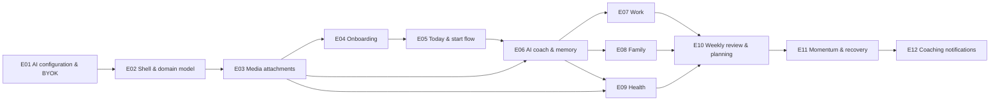

# Epic specifications

This folder is the reviewable source of truth for EvolvePath's product roadmap, broken into GitHub epics and child issues that Claude Code can execute without guesswork. One file per epic (`E<NN>-<slug>.md`) holds the epic body (goal, background, scope, sequencing, manual end-to-end verification) and the full body of every child issue. The files are parsed programmatically to create the GitHub issues, and issue numbers are back-filled here afterwards, so **the format below is strict**.

The human-readable status snapshot — which epics are done, how many children each has closed, the dependency graph with links — lives in [`ROADMAP.md`](../../ROADMAP.md) at the repository root, beside [`VISION.md`](../../VISION.md) and [`PRD.md`](../../PRD.md). This folder holds the detail; the roadmap holds the state.

## Epic roster

| # | Phase | Epic | Goal (one line) | PRD refs | GitHub |
|---|---|---|---|---|---|
| E01 | 1 · Foundation | AI Provider Configuration & Bring-Your-Own-Key | Admin configures OpenAI (platform key, per-persona models from a live catalog filtered to GPT ≥ 5.4, test connection); every user brings their own encrypted key, gated at first login; one `AiGatewayService` every later feature calls. | §14, §88, §115, §117, §118, §120 | [#20](https://github.com/marinoscar/evolvepath/issues/20) |
| E02 | 1 · Foundation | Product Shell, Domain Model & Path Screen | Deterministic state before AI: Best Self, Outcomes, versioned Plans, Routines, Commitments, Evidence; the five-tab navigation (Today/Path/Coach/Progress/Profile); PWA basics. | §9, §10, §11, §80, §103, §123 | [#33](https://github.com/marinoscar/evolvepath/issues/33) |
| E03 | 1 · Foundation | Media Attachments for AI Advice | Photos and videos uploadable from the phone camera, MIME/size enforcement, server-side video frame sampling, attachable to AI calls. | §46, user requirement | [#67](https://github.com/marinoscar/evolvepath/issues/67) |
| E04 | 2 · Core loop | Onboarding: Best Self → First Path | AI-assisted 5–8 minute onboarding producing a persisted, approved first plan; coaching style; time reality. | §19–§21, §43–§44, §70–§72, §102 | [#99](https://github.com/marinoscar/evolvepath/issues/99) |
| E05 | 2 · Core loop | Today Screen, Commitments Lifecycle & Start Flow | Deterministic next-best-action engine, domain cards, Start/Continue/Fallback/Reschedule/Skip, daily check-in, evidence. | §12, §13, §27, §28, §73, §74 | [#34](https://github.com/marinoscar/evolvepath/issues/34) |
| E06 | 2 · Core loop | AI Coach: Context Assembler, Coaching Reasoner, Mutation Protocol & Memory | Coach screen, structured proposals with diff/approve, memory insights under user control, safety layer. | §14.1–14.3, §14.8, §15–§18, §66–§68, §85 | [#57](https://github.com/marinoscar/evolvepath/issues/57) |
| E07 | 3 · Domains | Work Domain: Focus Sessions & Anti-Procrastination | Focus timer, decomposition, avoidance detection, intervention ladder. | §22–§29, §104 | [#97](https://github.com/marinoscar/evolvepath/issues/97) |
| E08 | 3 · Domains | Family Domain: Commitments & Rituals | Recurring rituals, minimal family-member records, presence cues, no scoring. | §30–§35, §105 | [#35](https://github.com/marinoscar/evolvepath/issues/35) |
| E09 | 3 · Domains | Health Domain: Workout Programs, Runner & Media Coaching | AI program builder (structured), persistence, runner with logging, progression rules, fallbacks, video form-check and photo advice, nutrition behaviours, optional weight trend. | §36–§47, §106 | [#66](https://github.com/marinoscar/evolvepath/issues/66) |
| E10 | 4 · Adaptation | Weekly Review & Weekly Planning | Planned-vs-actual, Weekly Review Reasoner, plan diffs → new plan version, domain modes, cross-domain load check. | §48–§51, §14.6 | [#60](https://github.com/marinoscar/evolvepath/issues/60) |
| E11 | 4 · Adaptation | Momentum, Progress & Recovery | Deterministic momentum states, evidence timeline, consistency runs, comeback loop, no catch-up debt, celebrations. | §52–§57, §75–§77, §109 | [#94](https://github.com/marinoscar/evolvepath/issues/94) |
| E12 | 4 · Adaptation | Coaching Notifications | Deterministic decision engine (quiet hours, caps, fatigue), categories N1–N9, AI copy generator, deep-link actions, independence metric. | §58–§65, §14.7, §108 | [#44](https://github.com/marinoscar/evolvepath/issues/44) |

Explicitly deferred (PRD §100, §112, §113): wearables, calendar integration, voice, home-screen widgets, social/accountability, calorie database, monetization. `ROADMAP.md` carries the list so nobody re-litigates it per epic.

## Dependency graph



Phases: **1 Foundation** E01–E03 · **2 Core loop** E04–E06 · **3 Domains** E07–E09 (parallel once E06 lands) · **4 Adaptation** E10–E12.

## Delivery principle

Every epic is testable end to end — database, API and UI — on its own, against the fake OpenAI server introduced in E01-10 (`infra/compose/fake-openai.compose.yml`), with no external account. Each epic body ends with a **Manual end-to-end verification** script the product owner runs from a clean clone (compose up, migrate, seed, `/testing/login`, exact URLs, what to observe, `psql` checks). Each epic's **last child** is `test(tests): E<NN> end-to-end verification`: it adds the Playwright spec(s) that prove the epic, the epic's `docs/specs/<name>.md`, and a back-link to its `docs/epics` file. E01 is the one exception in ordering — its fake-server/e2e child is E01-10 and its docs child E01-12, because both are consumed by every later epic and were split so the docs could land after the surface settled.

Cross-epic contracts are fixed by the epic that introduces them and changed only through it: the `AiGatewayService.invoke()` signature and persona keys (E01), the domain schema (E02), the `AiAttachment` / video-frame metadata shape (E01-06 consumes, E03-03 produces), the plan-change proposal protocol (E06-04).

## File format (strict — parsed programmatically)

File name: `docs/epics/E<NN>-<slug>.md` (e.g. `E01-ai-configuration-byok.md`). One epic per file.

```
# E01 — <Epic title>

<!-- epic-meta: slug=ai-configuration-byok phase=1 -->

## Epic

### Goal
<2–5 sentences: outcome + value, ties to VISION/PRD>

### Background
<context, constraints, the codebase facts this epic builds on, links to docs/specs files>

### Scope
- [ ] E01-01 <child title>
- [ ] E01-02 <child title>
...

### Out of scope
<bullets>

### Sequencing
<dependency notes: what can run in parallel, critical path>

### Manual end-to-end verification
<numbered script the product owner runs from a clean clone: compose up, seed, login via /testing/login, exact URLs, what to observe, DB checks via psql>

## Child issues

### E01-01 `feat(db): <title>`

<child body — see template below>

---

### E01-02 `feat(api): <title>`

<child body>

---
```

Rules:

- The child heading is exactly `### E<NN>-<MM> \`<conventional-commit title>\`` — the backticked title becomes the GitHub issue title verbatim.
- Children are separated by a line containing only `---`.
- No `## ` (H2) headings inside a child body; subsections are `#### ` (they render fine on GitHub).
- `E<NN>-<MM>` numbering must match the Scope list order; the parser rejects a mismatch.
- No GitHub issue numbers in the source until back-filled. Refer to other children as `E01-04` (same epic) or `E03-03` (other epic).
- Titles: `<type>(<scope>): <imperative summary>`; types `feat|fix|refactor|test|docs|chore`; scopes `api, web, db, infra, auth, core, docs, tests`.
- Component values: `web, api, cli, docs, infra, core, database`. Priority `P0` for everything in V1 unless the PRD marks P1.

## Child issue body template (all sections, in this order)

```
**Part of epic:** E01 · **Blocked by:** E01-02, E01-03 (or "none") · **Component:** api, database · **Priority:** P0 · **Agents:** database-dev → backend-dev → testing-dev → docs-dev

#### Problem statement
<why; cite PRD/VISION sections>

#### Proposed solution
<what to build, concretely>

**Data (database-dev)** — Prisma models with fields/enums/indexes/relations, migration name `add_<thing>`, seed changes. Write "n/a" when none.

**API (backend-dev)** — endpoints table: | Method | Path | Permission / guard | Request | Response |; services + key methods; audit actions `<domain>:<verb>`; error codes; OpenAPI tag to register in `apps/api/src/openapi/tags.ts`.

**UI (frontend-dev)** — routes in `apps/web/src/App.tsx`, registry cards (`ADMIN_SECTIONS` / `USER_SETTINGS_SECTIONS` / `DESTINATIONS`), components with props, hooks, `services/api.ts` functions, `types/index.ts` types; responsive behaviour at the `sm` (600px) boundary; a11y notes.

**Tests (testing-dev)** — unit (Jest, colocated `.spec.ts`), integration (`apps/api/test/**/*.integration.spec.ts` using `createTestApp` + `overrideProviders`), web (Vitest + RTL + MSW under `apps/web/src/__tests__/`), e2e (`tests/e2e/specs/*.spec.ts`) — list concrete cases.

**Docs (docs-dev)** — files to update (`docs/API.md`, `CLAUDE.md` sections, `docs/specs/<name>.md`, `.env.example`).

#### Acceptance criteria
- [ ] user-observable, testable statements (5–12)

#### Definition of done
- [ ] Scope/exclusions respected; interfaces as specified
- [ ] Error handling: <specific expectations>
- [ ] Observability: <logs/metrics/spans/audit>
- [ ] Security: <authn/authz/least privilege/secrets>
- [ ] Config & secrets: <env vars, defaults>
- [ ] Tests listed above pass locally (`npm test` in `apps/api`, `npm run test:run` in `apps/web`; e2e where listed)
- [ ] Docs updated

#### Manual test script
1. numbered, exact commands/URLs/expected results (can reference the epic-level script and add the delta)

#### Out of scope
- bullets

#### Notes for the implementing agent
- reuse pointers (file paths of the pattern to copy), pitfalls (e.g. Fastify vs Express, Zod not class-validator, `npm run prisma:*` scripts not bare npx, register OpenAPI tags, five coupled breakpoint gates)
```

Conventions every child must respect (they mirror `CLAUDE.md`):

- Admin surfaces reuse `system_settings:read` / `system_settings:write`; per-user resources are plain `@Auth()` with ownership by construction; a new permission string is justified in the issue and updates both `apps/api/src/common/constants/roles.constants.ts` and `apps/api/prisma/seed.ts`.
- Every settings page is a registry card first (`apps/web/src/config/adminSections.tsx` / `userSettingsSections.tsx`), reuses `SettingsHub`, and is never a new tab on an existing page. The five coupled breakpoint gates are not touched unless the issue is about them.
- New system settings get their own `system_settings` row key, never a key inside `'global'`. Secrets go through `CredentialsService`, never into JSONB or logs; response DTOs carry a compile-time "carries no secret" proof.
- Audit is a direct `prisma.auditEvent.create` with `action '<domain>:<verb>'`.
- AI calls always go through `AiGatewayService.invoke(...)` (E01-06); results are `{ ok: true, output }` or `{ ok: false, error: { code, message } }` — never thrown. Deterministic product logic works when AI is unavailable (PRD §120). AI never mutates plans directly: proposal → user accepts → new PlanVersion (PRD §15).
- Prisma changes use `npm run prisma:migrate:dev -- --name <name>`; product tables carry a `userId` FK with `onDelete: Cascade` unless they are telemetry (`SetNull`).

## Creating the GitHub issues from these files

1. Parse and validate: the main agent runs the parser over `docs/epics/` (it checks the H1, the `epic-meta` comment, the `## Epic` / `## Child issues` split, every child heading, the seven required `####` sections, no H2 inside a child, and Scope-list ⇄ children agreement). Fix every reported problem before creating anything.
2. Create the **epic issue** first: title `Epic: <Epic title>`, labels `epic` and `epic:<slug>`, body = the `## Epic` section with the Scope checklist still in `- [ ] E01-01 …` form.
3. Create each **child** in Scope order: type `Feature`, labels `enhancement` and `epic:<slug>`, title = the backticked heading verbatim, body = the child body with `**Part of epic:** #<epic>` and `**Blocked by:** #<n>, #<m>` resolved to real numbers (same-epic references resolve in order; cross-epic references resolve after that epic is created, otherwise stay as `E03-03` until back-filled). Attach each child as a GitHub **sub-issue** of the epic (`parent_issue_number`) so the epic shows the native "N of M completed" progress bar.
4. **Back-fill numbers**: rewrite the epic issue's Scope checklist as `- [ ] #N <title>`; record `#N` in the spec file on the line directly under each `### E<NN>-<MM>` heading as `_GitHub: #N_` (never as a suffix on the heading line itself — the parser requires the heading to end right after the closing backtick); replace `_pending_` in the roster table above with the epic issue link; regenerate the per-epic checklists in `ROADMAP.md`.
5. Verify: `issue_read` on the epic shows `has_children: true` and a `sub_issues_summary.total` equal to the child count in the file.

## Maintenance rule

- When a child issue closes, in the **same PR**: tick it in the epic's Scope list in `ROADMAP.md` and in the epic file's Scope list, and update the roster status if it changed. GitHub's sub-issue progress is the live counter; `ROADMAP.md` is the snapshot committed with the code.
- An epic is **Done** when every child is closed and its manual end-to-end verification has been run once on a clean clone; set the status in `ROADMAP.md` and close the epic issue with `state_reason: completed`.
- A change to a cross-epic contract (gateway signature, persona keys, domain schema, attachment shape, proposal protocol) is made in the owning epic's spec file first, then in the dependent files, in one PR.
- Spec files are never rewritten to match drift in code; if the code has to differ from the spec, the issue gets a comment and the spec file a short "Deviation" note under the affected child.

See [`ROADMAP.md`](../../ROADMAP.md) for status, and [`E01-ai-configuration-byok.md`](E01-ai-configuration-byok.md) for the fully worked example of the format.

## Tooling (`docs/epics/tools/`)

Three zero-dependency Node scripts keep the spec files, GitHub issues and `ROADMAP.md` in sync. Run them from the repo root with a scratch directory of your choice:

```bash
node docs/epics/tools/parse-epics.mjs docs/epics /tmp/epics        # validate the strict format; emits /tmp/epics/E0N.json
node docs/epics/tools/backfill.mjs /tmp/epics docs/epics .          # needs /tmp/epics/E0N.map.json ({"E0N": <epic#>, "E0N-01": <child#>, …}); rewrites specs, this README and ROADMAP.md
node docs/epics/tools/gen-updates.mjs /tmp/epics                    # emits /tmp/epics/updates/<issue#>.md bodies with real #N references for GitHub issue updates
```

Workflow for a new epic: write `docs/epics/E<NN>-<slug>.md` in the format above → `parse-epics.mjs` until it reports no problems → create the epic issue and its children as GitHub sub-issues → record the numbers in `E<NN>.map.json` → `backfill.mjs` + `gen-updates.mjs` → update the GitHub bodies → commit.
