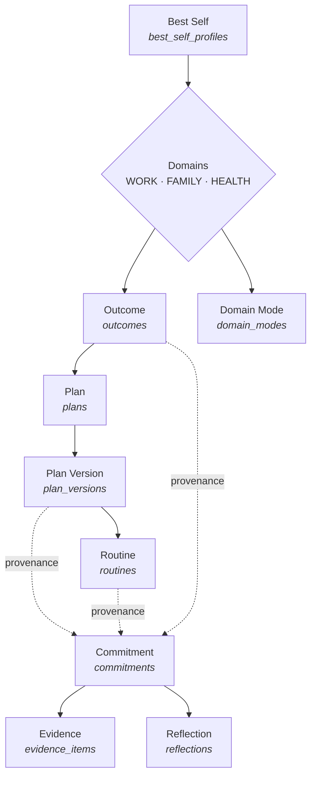

# The EvolvePath domain model

**Status:** current · **Established by:** epic [#33](https://github.com/marinoscar/evolvepath/issues/33) (E02) · **Sources:** PRD §9, §10, §57, §80, §103, §127 · VISION Part VI §24

This is the written contract for the product's core tables. E04–E11 build on
what is here rather than on reading `schema.prisma`, so a change to this
document and a change to the schema are the same change.

`CLAUDE.md` states the rules in brief; this file explains *why* each is the way
it is, and — as importantly — records the alternatives that were rejected, so
they are not re-proposed as improvements.

---

## 1. The hierarchy

PRD §9 requires the hierarchy to be "represented explicitly in the product" and
VISION Part VI §24 that it be "visible throughout the experience". It is not
implied by a conversation; every rung is a table.



Solid edges are ownership (a cascade). Dotted edges are **provenance**: a
commitment records where it came from, and survives the loss of it (`SET NULL`).

---

## 2. Enums

Every member below is exactly what `schema.prisma` declares.
`apps/api/test/docs/domain-model-doc.spec.ts` asserts that: it reads the
generated Prisma client and fails if any enum member or table name here is
missing, or if the schema grows one this document does not mention.

| Enum | Members | Meaning |
|---|---|---|
| `Domain` | `WORK`, `FAMILY`, `HEALTH` | The three areas everything is filed under. |
| `OutcomeState` | `ACTIVE`, `PAUSED`, `COMPLETED`, `ARCHIVED` | An outcome's lifecycle. `ARCHIVED` is reached only through `POST /outcomes/:id/archive`. |
| `PlanVersionStatus` | `DRAFT`, `ACTIVE`, `SUPERSEDED`, `REJECTED` | See §4. |
| `PlanAuthor` | `USER`, `AI` | Who wrote a version. E02 only ever writes `USER`. |
| `RoutineTriggerType` | `TIME`, `EVENT` | What starts a behaviour: a clock time, or something else that happens. |
| `RoutineFrequency` | `DAILY`, `WEEKDAYS`, `WEEKENDS`, `WEEKLY`, `CUSTOM` | How often. `daysOfWeek` is meaningful only for `CUSTOM`. |
| `CommitmentStatus` | `PLANNED`, `READY`, `STARTED`, `COMPLETED`, `PARTIALLY_COMPLETED`, `RESCHEDULED`, `SKIPPED`, `MISSED`, `CANCELLED` | See §6. |
| `EvidenceSource` | `USER_LOG`, `TIMER`, `WORKOUT_LOG`, `APP_FLOW` | Who observed the fact. See §7. |
| `DomainModeKind` | `GROW`, `MAINTAIN`, `RECOVER`, `PAUSE` | Per-domain posture (PRD §49). |

**Never rename or reuse an enum member.** They are persisted on live rows and
appear in every audit entry; renaming one is a data migration over history, not
a refactor.

---

## 3. Tables

| Table | Purpose | Key invariants |
|---|---|---|
| `best_self_profiles` | Who the user is trying to become (PRD §10.2). | One row per user (`@@unique([userId])`). Replaced whole — there is no PATCH. `lastReviewedAt` is stamped on every replacement. |
| `outcomes` | A meaningful result in one domain (PRD §10.4). | `domain` is immutable after creation. `targetDate` is a `date`, not a timestamp. `importance` and `userConfidence` are 1–5, bounded by the DTO rather than a CHECK. |
| `plans` | The *identity* of an outcome's plan, and nothing else. | `outcome_id` is `UNIQUE`: one plan per outcome. |
| `plan_versions` | Everything a user would call "the plan". | Exactly one `ACTIVE` per plan, by partial unique index. `@@unique([planId, version])`. Immutable once out of `DRAFT`. |
| `routines` | A repeatable behaviour a version prescribes (PRD §10.6). | Belongs to exactly one version, for that version's life. `minimumDurationMin ≤ estimatedDurationMin`. |
| `commitments` | One intended action at one time (PRD §10.7). | Status moves only along the matrix in §6. Every upward link is `SET NULL`. |
| `evidence_items` | What actually happened (PRD §10.9). | Outlives its commitment. Never derived from a planned item. |
| `reflections` | What the user made of it (PRD §10.10). | `relatedType`/`relatedId` is a soft pointer; ownership is checked in the service, per type. |
| `domain_modes` | Current posture per domain (PRD §49). | At most one row per user per domain. **Absent means `GROW`** — nothing is seeded. |

### Why every table carries `user_id`

`plan_versions` could reach its owner through plan → outcome → user, and
`routines` through one more hop. They store `userId` anyway, so an ownership
check is a single indexed predicate — `findFirst({ where: { id, userId } })` —
rather than a three-table join that is one refactor away from being dropped.
The `ON DELETE CASCADE` on that relation is also what makes account deletion
whole, and it is asserted against a real database in
`apps/api/test/db/core-domain-schema.integration.spec.ts`.

---

## 4. Plans are versioned, always

PRD §80 wants "Changed Sep 12 · Reason: 3 repeated evening misses" renderable
for any change. PRD §103 requires that a plan can change, that the user can
inspect *why*, and that the previous shape stays readable.

A single mutable `plans` row satisfies none of those: the rationale for a change
has nowhere to live, and the previous shape is gone the moment it is edited. So
`Plan` is an identity and `PlanVersion` holds everything else.

```
              activate
   DRAFT ─────────────────► ACTIVE ─────────────────► SUPERSEDED
     │                   (at most one per plan)        (activeUntil set)
     │  reject
     └──────────► REJECTED
```

**The rules, and what each is for:**

- **One `ACTIVE` version per plan**, enforced by a **partial unique index**
  hand-written in the migration:
  ```sql
  CREATE UNIQUE INDEX "plan_versions_one_active_per_plan"
    ON "plan_versions"("plan_id") WHERE "status" = 'ACTIVE';
  ```
  Prisma's schema language cannot express `WHERE`, and its introspection ignores
  partial indexes — so this survives `migrate dev` without being reported as
  drift. If a regenerated migration ever drops it, the integration spec fails.
- **Activation is one transaction**: supersede, then activate. Between the two
  writes there would otherwise be an instant with two `ACTIVE` versions, which
  the index rejects — a non-transactional implementation fails under any
  concurrency at all. A `P2002` escaping the transaction means a genuine race,
  and is mapped to **409**, never 500.
- **`rationale` is required on every version after the first.** The first has
  no change to explain; every later one does, and the moment the user knew why
  has passed by the time anybody notices it is missing.
- **One `DRAFT` at a time**, and this is a **service rule, not a database
  constraint**. Do not add a second partial index for it: the rule is a product
  decision about focus, while the `ACTIVE` index is an integrity invariant, and
  E06 may well want to propose an alternative alongside the user's own draft.
- **Routines are cloned into a new version, never moved.** The source version
  keeps its own, which is what makes both sides of a change inspectable. A
  `SUPERSEDED` or `REJECTED` version's routines are read-only.

---

## 5. Evidence outlives its commitment

`evidence_items.commitment_id` and `reflections.commitment_id` are `SET NULL`,
never `CASCADE`.

A user who deletes a commitment is tidying their schedule, not disowning the
fact that they did the work — and momentum (E11) is computed from evidence, so
cascading would silently rewrite their history. PRD §103 states it directly:
"old commitments remain historical evidence."

---

## 6. The commitment state machine

The matrix lives in `apps/api/src/commitments/commitment-transitions.ts`, free
of framework imports so it can be exhaustively unit-tested (all 81 pairs, not a
sample). `apps/web/src/utils/commitmentTransitions.ts` is a verbatim copy; each
file points at the other.

| From | May move to |
|---|---|
| `PLANNED` | `READY`, `STARTED`, `COMPLETED`, `PARTIALLY_COMPLETED`, `RESCHEDULED`, `SKIPPED`, `MISSED`, `CANCELLED` |
| `READY` | `PLANNED`, `STARTED`, `COMPLETED`, `PARTIALLY_COMPLETED`, `RESCHEDULED`, `SKIPPED`, `MISSED`, `CANCELLED` |
| `STARTED` | `COMPLETED`, `PARTIALLY_COMPLETED`, `RESCHEDULED`, `SKIPPED`, `CANCELLED` |
| `COMPLETED`, `PARTIALLY_COMPLETED`, `RESCHEDULED`, `SKIPPED`, `MISSED`, `CANCELLED` | *nothing — terminal* |

A status never transitions to itself: re-applying one is not a transition, and
treating it as one would make a double-tapped button write a second audit row
and move `startedAt`.

**Four edges are decisions, not omissions:**

- **`PLANNED → STARTED` is direct.** PRD P4 ("start matters") wants the start
  recorded whenever it happens; a mandatory `READY` step would make the product
  either invent one or lose the fact that the user started.
- **`PLANNED → COMPLETED` is legal** (widened by E05-02, #40). Most of what a
  user does happens away from the app: they went for the run and then opened
  their phone. Requiring a start first would force the product to choose between
  refusing an honest "I did it" and *manufacturing* a start — a `startedAt` and
  an `APP_FLOW started` row for something it never observed, which §7 forbids.
  So the matrix allows the jump and the action layer writes no start evidence:
  `startedAt` stays null, and that null is itself the honest record that the
  timer was never used.
- **Everything past `STARTED` is terminal.** An honest record of a day is what
  the user did; an undo would make evidence untrustworthy. To change your mind,
  create a new commitment — the old one stays as history.
- **`STARTED` cannot become `MISSED`.** Started-and-unfinished is
  `PARTIALLY_COMPLETED` or `SKIPPED`, both of which the user chooses. `MISSED`
  is for a commitment whose time passed untouched; E11's comeback loop sets it.

`STARTED → READY` is deliberately absent, and pausing is why. **Paused is
`STARTED` with `activeSince: null`** — the timer is a pair of columns
(`activeSeconds` banked at the last pause, `activeSince` for the current run),
not a status. Elapsed time is derived at read time rather than stored, so a
reloaded page, a second device and a phone that slept all agree, and a client
clock cannot inflate the record. Adding a `PAUSED` member would give one fact
two sources of truth.

**Intent-named actions** (`POST /commitments/:id/actions/*`, E05-02) sit on top
of this matrix rather than replacing it. They exist because the matrix answers
"which status may follow" and a screen asks "which button do I show" — and those
differ: `pause`/`continue` change no status, `fallback` and `decompose` change
none either, and `start`/`continue` are one button to a user and two operations
to the server. Each action owns the timer columns, the evidence row and the
audit action for one intent; the matrix stays the single owner of the statuses.

**Rescheduling** closes the original (terminal, keeping its evidence) and opens
a **new** `PLANNED` commitment at the new time, copying the title, importance,
links and the three versions, with `rescheduledFromId` set and
`rescheduleCount` **incremented**. The count travels with the *intention*, not
the row, so "moved twice" is readable on the live commitment — which is the one
E07's avoidance detection looks at.

---

## 7. Evidence is never invented

PRD §10.9: "the product should not pretend planned calendar events are
completion evidence."

- **Creating a commitment writes no evidence.** A commitment is a plan.
- **Completing one writes none either, unless the user supplied something to
  log.** Completion is a *status*; evidence is a fact the user asserted. The
  transition endpoint creates a row only when `evidence` is present in the body.
- **`POST /evidence` accepts `source: "USER_LOG"` and nothing else** — the DTO
  declares a literal, not the enum. `TIMER`, `WORKOUT_LOG` and `APP_FLOW` mean
  *"the system observed this"*, and a client able to claim them could
  manufacture observations. They are written only by
  `EvidenceService.createFromFlow`, which no route exposes — the entry point
  E05's Start flow, E07's focus sessions and E09's workout runner will use.

Both halves are proved end to end in `tests/e2e/specs/path.spec.ts`.

---

## 8. Ownership: 404, never 403

Every per-user lookup goes through `findOwnedOrThrow`
(`apps/api/src/path/owned-resource.ts`), which resolves a query that is
*already* scoped to `{ id, userId }` and throws `NotFoundException` when it
finds nothing.

**A 403 confirms the row exists.** `GET /outcomes/<someone else's id>` answering
"Forbidden" tells an attacker they guessed a real id; answering "Not found"
tells them nothing. The two responses must be byte-identical, which they are
only if one code path produces them.

The shape of the *lookup* matters as much as the response: callers pass a query
that already filters on `userId`, rather than fetching by id and comparing
afterwards. The second form works today and is one refactor away from a leak,
because the row is in memory by the time anybody decides what to do with it.

The web app makes **no** authorization decision of its own. The outcome detail
page renders a not-found state for a 404 rather than redirecting — a redirect
would make a mistyped URL look like a working one.

---

## 9. Audit actions

Written **after** the transaction commits, never inside it. `meta` records
structure, never user prose: `audit_events` is admin-readable, and an identity
statement is the most personal sentence in this product.

| Action | `targetType` | `meta` |
|---|---|---|
| `best_self:replace` | `best_self_profile` | `{ fields: string[] }` — which fields were filled in, never their contents |
| `outcome:create` | `outcome` | `{ domain, importance }` |
| `outcome:update` | `outcome` | `{ changed: string[] }` |
| `outcome:archive` | `outcome` | `{ domain }` |
| `domain_mode:set` | `domain_mode` | `{ domain, from, to }` |
| `plan:create` | `plan` | `{ outcomeId, routines }` |
| `plan_version:create` | `plan_version` | `{ planId, version, previousVersionId, createdBy, routinesCopied }` |
| `plan_version:update` | `plan_version` | `{ planId, version, changed }` |
| `plan_version:activate` | `plan_version` | `{ planId, version, supersededVersion }` |
| `plan_version:reject` | `plan_version` | `{ planId, version, hasReason }` |
| `routine:create` / `:update` / `:delete` | `routine` | `{ planVersionId, … }` |
| `commitment:create` | `commitment` | `{ domain, planVersionId, routineId, rescheduledFromId }` |
| `commitment:update` | `commitment` | `{ changed: string[] }` |
| `commitment:transition` | `commitment` | `{ from, to, rescheduleCount, rescheduledToId, evidenceId }` |
| `evidence:create` / `:delete` | `evidence` | `{ source, evidenceType, commitmentId }` |
| `reflection:create` | `reflection` | `{ relatedType, relatedId }` |

---

## 10. URL and payload conventions

- **`:version` in a URL is the integer**, not the version's UUID — "v2" is what
  the user sees. `previousVersionId` links by id internally.
- **`createdBy` is never accepted from a request body.** `PlanVersionsService.createDraft`
  takes an `author` parameter so E06 can create AI-authored drafts through the
  same code path, and no route sets it: a client that could claim `AI` would be
  able to launder a user edit as a coach suggestion.
- **`status` is not a field on `PATCH /commitments/:id`.** There is exactly one
  way to move a status, and it validates the matrix.
- **Range queries require `from` and `to`.** Commitments cap at 62 days (two of
  the longest months — "this month and next"); evidence at 93, because momentum
  is read from it. An unbounded listing grows without limit for an active user
  and no screen wants one.
- **`status` filters are CSV**, not repeated keys: Fastify parses `?status=A`
  as a string and `?status=A&status=B` as an array, so one spelling avoids a
  schema that breaks on the other.
- **Error `code` is derived from the HTTP status** and is a closed published
  enum (`common/dto/error.dto.ts`). Endpoint-specific discriminators live in
  `details` — an invalid transition is a `CONFLICT` carrying
  `details.reason = "INVALID_TRANSITION"`, plus `from` and `to`.

---

## 11. Extending the model (E04–E11)

**Add your own tables. Do not change these.** Every table here is referenced by
live rows, by audit history, and by the specs above.

| Epic | Adds | Must not touch |
|---|---|---|
| E04 Onboarding | `user_profiles` (timezone, locale, onboarding state) — **landed**, #100 | Writes outcomes/plans through the same services, with `createdBy: USER` after approval |
| E05 Today | `daily_check_ins`, plus execution columns on `commitments` (`activeSince`, `activeSeconds`, `timerMinutes`, `versionUsed`, `minutesSpent`, `steps`, `decomposedFromId`, `skipNote`, per-version minutes) and the `CommitmentVersion` enum — **landed**, #40 | Widened the matrix (both copies, both tests); writes `APP_FLOW` evidence via `createFromFlow`'s rules |
| E06 AI Coach | `coach_conversations`, `plan_change_proposals`, `memory_insights`, `obstacles` | Creates plan versions via `createDraft(…, 'AI')`; never writes `plan_versions` directly |
| E07 Work/Focus | `focus_sessions` | Writes `TIMER` evidence via `createFromFlow`; reads `rescheduleCount` |
| E08 Family | `family_members`, `rituals`, ritual links on commitments | May add a nullable column to `commitments`; may not change its status matrix without a test |
| E09 Health | workout schema, exercise catalog | Writes `WORKOUT_LOG` evidence via `createFromFlow` |
| E11 Momentum | consistency/momentum tables | Reads `evidence_items`; must not delete or rewrite them |

Two changes need more than a migration:

- **Extending the transition matrix.** `commitment-transitions.ts` is
  exhaustively tested and copied to the web app. Both copies and both tests
  change together, or the UI offers a move the API refuses.
- **Adding an `EvidenceSource`.** Decide first whether a client may claim it.
  If not — and the answer has so far always been no — it goes through
  `createFromFlow` and stays out of the request DTO's literal.

---

## 12. Related documents

- [`docs/ARCHITECTURE.md`](../ARCHITECTURE.md) §6.3 — where this sits in the data architecture
- [`docs/API.md`](../API.md) — the EvolvePath endpoints, request and response shapes
- [`docs/specs/settings-ui.md`](./settings-ui.md) — the navigation and settings rules the Path screen lives inside
- `apps/api/prisma/schema.prisma` — the schema itself, with the same rationale in its header
